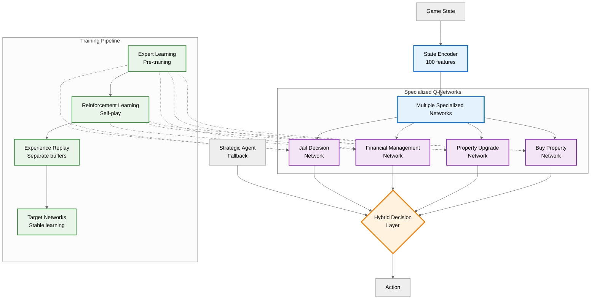

<h1>Monopoly RL Agent</h1>
<h2>A Reinforcement Learning Environment and a DQN Agent for Monopoly Game Strategy Optimization</h2>


<br>
<hr>
<h2>About it</h2>
<p>This project implements a comprehensive <strong>reinforcement learning environment for the Monopoly board game</strong>, featuring a novel hybrid Deep Q-Network (DQN) architecture that combines algorithmic strategies with learned behaviors. The system was developed as part of a bachelor's thesis project to explore advanced AI decision-making in complex, multi-agent, stochastic environments.</p>

<h3>Key Innovations</h3>
<ul>
    <li><strong>Novel Hybrid Architecture</strong>: The project introduces a groundbreaking approach where multiple specialized neural networks handle different decision types, while algorithmic agents provide expert knowledge for complex scenarios with large action spaces.</li>
    <li><strong>Multi-Network DQN Design</strong>: Unlike traditional single-network approaches, this implementation uses separate networks for each major action type (property management, trading, financial decisions), enabling focused learning and improved decision accuracy.</li>
    <li><strong>Expert Learning Integration</strong>: The system implements supervised pre-training using expert agents, followed by reinforcement learning through environmental interaction, significantly reducing training time and improving convergence.</li>
    <li><strong>Optimized Game Simulation</strong>: Custom-built Monopoly environment with faithful rule implementation, optimized for fast simulation and RL training with proper state validation and error handling.</li>
</ul>

<h3>Achievement Highlights</h3>
<ul>
    <li><strong>90% win rate</strong> against the parent algorithmic agent</li>
    <li><strong>5.3% point improvement</strong> in 12-agent round-robin tournaments compared to the baseline model</li>
    <li>Faithful reproduction of official Monopoly rules with RL-friendly adaptations</li>
    <li>Real-time game visualization with <b>React frontend</b></li>
    <li>Comprehensive tournament management system for agent comparison</li>
    <li>Support for multiple agent types: random, algorithmic, strategic variants, and advanced DQN</li>
    <li>Ideal for research, benchmarking, and educational purposes in multi-agent reinforcement learning</li>
</ul>

<br>
<hr>

<h2>How to use it</h2>
<h3>Prerequisites</h3>
<ul>
    <li><strong>Python 3.10+</strong> (developed and tested with Python 3.10.15)</li>
    <li><strong>macOS with MPS support</strong> (for GPU acceleration) or <strong>Windows/Linux</strong> with CUDA</li>
    <li><strong>Node.js 16+</strong> and <strong>npm</strong> for the frontend interface</li>
</ul>

<blockquote>
    <p>
    <strong>NOTE</strong>: For this you will need to have <code>conda</code> installed. If you do not have it, you can install it by following the instructions from the <a href="https://docs.conda.io/projects/conda/en/latest/user-guide/install/index.html">official documentation</a>.
    </p>
</blockquote>

<h3>Backend Setup (Python Environment)</h3>
<p><strong>1. Create and activate conda environment:</strong></p>

```python
conda create -n monopoly-rl python=3.10
conda activate monopoly-rl
```

<p><strong>2. Install dependencies:</strong></p>

```python
# Install requirements
pip install -r requirements.txt

# For macOS with MPS (GPU acceleration)
conda install -c apple tensorflow-deps
pip install tensorflow-macos==2.10.0
pip install tensorflow-metal==0.6.0

# For Windows/Linux (CPU/CUDA)
pip install tensorflow
```

<h3>Frontend Setup (React Interface)</h3>
<p><strong>1. Install dependencies:</strong></p>

```python
cd frontend
npm install
```

<h3>Quick Start Guide</h3>
<p><strong>Play a game against the DQN Agent:</strong></p>

<p><strong>1. Run the script which will take care of everything:</strong></p>

```python
cd src
python main.py
```

<p><strong>2. Access the interface:</strong></p>
<p>Open your browser and navigate to <a href="http://localhost:5173">http://localhost:5173</a></p>


<p><strong>Train a new DQN agent:</strong></p>

<p>For training a new agent, please refer to the training scripts, found in the <a href="https://github.com/w-i-l/monopoly-reinforcement-learning-agent/tree/main/src/dqn_scripts">dqn folder</a>. There you can find training scripts for each of the specialized networks, ehich you can configure however you want.</p>

<br>
<hr>

<h2>How it works</h2>
<h3>Environment Architecture</h3>
<p>The system is built with a modular, object-oriented design following software engineering best practices:</p>

<ul>
    <li><strong>Game State Management</strong>: Centralized state class that preserves all game attributes (player positions, balances, properties). All state updates are validated to ensure legal moves and maintain game integrity.</li>
    <li><strong>Game Manager</strong>: Coordinates game logic, player turns, and rule enforcement. Acts as the main controller, interfacing with specialized managers for different game aspects.</li>
    <li><strong>Specialized Managers</strong>: Modular components handle specific game mechanics: dice rolling, chance/community chest cards, trading, and property management with built-in validation.</li>
    <li><strong>Player Base Class</strong>: Abstract interface defining callback methods for agent decision-making. Supports multiple agent types with consistent API for easy extensibility.</li>
</ul>

<h3>Hybrid DQN Architecture</h3>



<p>The core innovation lies in the <strong>hybrid approach</strong> that combines the best of algorithmic and learning-based strategies:</p>

<h4>Multi-Network Design</h4>
<ul>
    <li><strong>Property Purchase Network</strong>: Specialized for buy/pass decisions on unowned properties</li>
    <li><strong>Property Management Network</strong>: Handles upgrade/downgrade decisions for owned properties</li>
    <li><strong>Jail Network</strong>: Manages player interactions while in jail, including decisions to pay bail or use a "Get Out of Jail Free" card</li>
    <li><strong>Financial Network</strong>: Handles mortgage/unmortgage and cash management decisions</li>
</ul>

<h4>Expert Learning Phase</h4>
<p>The system uses <strong>supervised learning</strong> to bootstrap the networks:</p>

<ol>
    <li>Collect gameplay data from expert algorithmic agents</li>
    <li>Pre-train each network on relevant decision scenarios</li>
    <li>Initialize with expert knowledge to reduce exploration time</li>
</ol>

<h4>Reinforcement Learning Phase</h4>
<p>Networks continue learning through environmental interaction:</p>

<ul>
    <li><strong>Experience Replay</strong>: Store and sample past experiences for stable learning</li>
    <li><strong>Target Networks</strong>: Separate target networks for stable Q-value updates</li>
    <li><strong>Epsilon-Greedy Exploration</strong>: Balance exploration vs exploitation</li>
    <li><strong>Reward Shaping</strong>: Custom reward functions for different game phases</li>
</ul>

<h3>State Representation and Action Spaces</h3>
<p>The environment encodes the complex Monopoly state into a format suitable for neural networks:</p>

<p><strong>State Vector Components:</strong></p>

<ul>
    <li>Player positions, cash, and property ownership (40 properties × 4 players)</li>
    <li>Property development levels and mortgage status</li>
    <li>Game phase indicators (early, mid, late game)</li>
    <li>Recent action history and opponent behavior patterns</li>
    <li>Dice roll outcomes and card draw results</li>
</ul>

<p><strong>Action Space Discretization:</strong></p>
<ul>
    <li>Binary decisions: Buy/Pass, Upgrade/Hold, Accept/Reject trade</li>
    <li>Categorical choices: Which properties to develop, mortgage priorities</li>
    <li>Hybrid decisions: Algorithmic for complex trades, learned for simple choices</li>
</ul>

<h3>Tournament and Evaluation System</h3>
<p>Comprehensive evaluation framework to assess agent performance:</p>

<ul>
    <li><strong>Round-Robin Tournaments</strong>: All agents play against each other multiple times</li>
    <li><strong>Statistical Analysis</strong>: Win rates, average game length, financial performance</li>
    <li><strong>Strategy Analysis</strong>: Property acquisition patterns, trading behavior</li>
    <li><strong>Performance Visualization</strong>: Real-time dashboard showing training progress</li>
</ul>

<br>
<hr>

<h2>Tech specs</h2>
<h3>Development Environment</h3>

<ul>
    <li><strong>Language</strong>: Python 3.10.15</li>
    <li><strong>AI Framework</strong>: TensorFlow 2.10.0 with Keras</li>
    <li><strong>GPU Acceleration</strong>: TensorFlow Metal 0.6.0 (macOS), CUDA (Windows/Linux)</li>
    <li><strong>Frontend</strong>: React 18.3.1 with Vite 6.0.1</li>
    <li><strong>API</strong>: FastAPI for backend services</li>
    <li><strong>Styling</strong>: Tailwind CSS 3.4.16</li>
</ul>

<h3>Machine Learning Architecture</h3>
<ul>
    <li><strong>Algorithm</strong>: Deep Q-Networks (DQN) with experience replay</li>
    <li><strong>Network Architecture</strong>: Multiple specialized networks for different action types</li>
    <li><strong>Training Paradigm</strong>: Hybrid approach combining supervised learning and reinforcement learning</li>
    <li><strong>Optimization</strong>: Adam optimizer with learning rate scheduling</li>
    <li><strong>Memory Management</strong>: Experience replay buffer</li>
</ul>

<h3>System Requirement on which the project was developed</h3>
<table>
    <thead>
        <tr>
            <th>Component</th>
            <th>Minimum</th>
        </tr>
        </thead>
    <tbody>
        <tr>
            <td>RAM</td>
            <td>16GB (shared memory)</td>
        </tr>
        <tr>
            <td>CPU</td>
            <td>10-core</td>
        </tr>
        <tr>
            <td>Storage</td>
            <td>10GB</td>
        </tr>
        <tr>
            <td>GPU</td>
            <td>M2 Pro GPU(16 cores)</td>
        </tr>
        <tr>
            <td>OS</td>
            <td>macOS Squoia 15.4.1</td>
        </tr>
    </tbody>
</table>

<h3>Performance Optimizations</h3>
<ul>
    <li><strong>Vectorized Operations</strong>: NumPy and TensorFlow operations for fast computation</li>
    <li><strong>Batch Processing</strong>: Efficient batch training with configurable batch sizes</li>
    <li><strong>Memory Pooling</strong>: Reuse of game state objects to reduce garbage collection</li>
    <li><strong>Parallel Simulation</strong>: Multiprocessing for tournament execution</li>
    <li><strong>Model Optimization</strong>: TensorFlow model optimization for deployment</li>
</ul>
